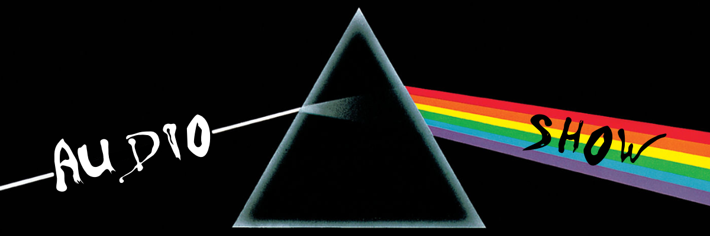
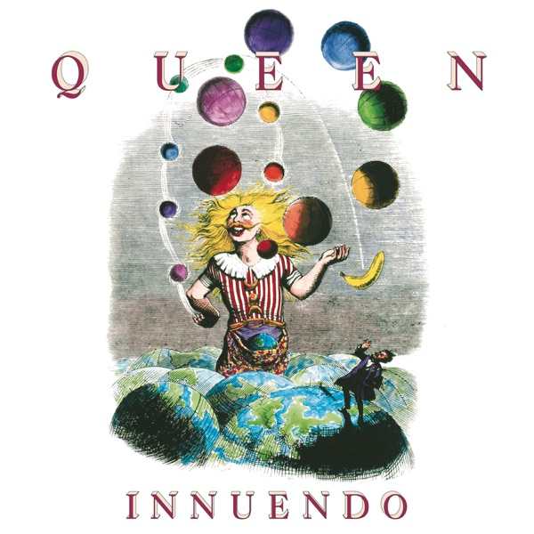
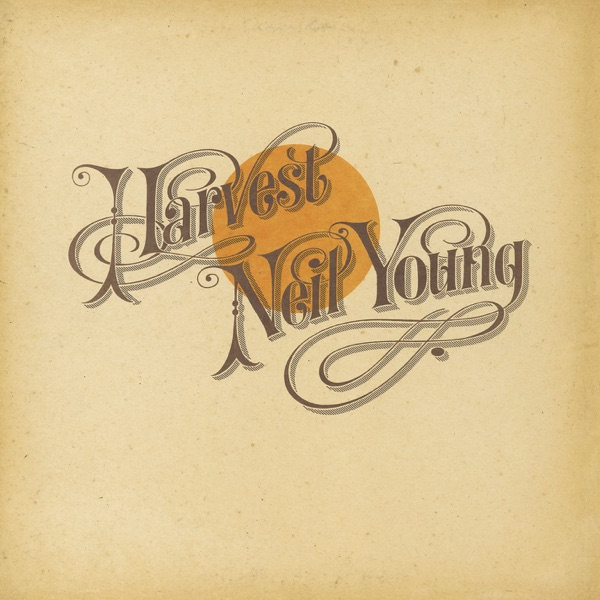
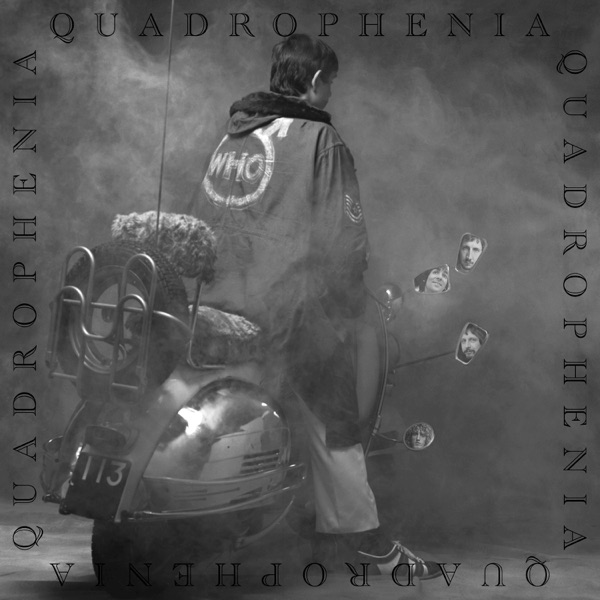
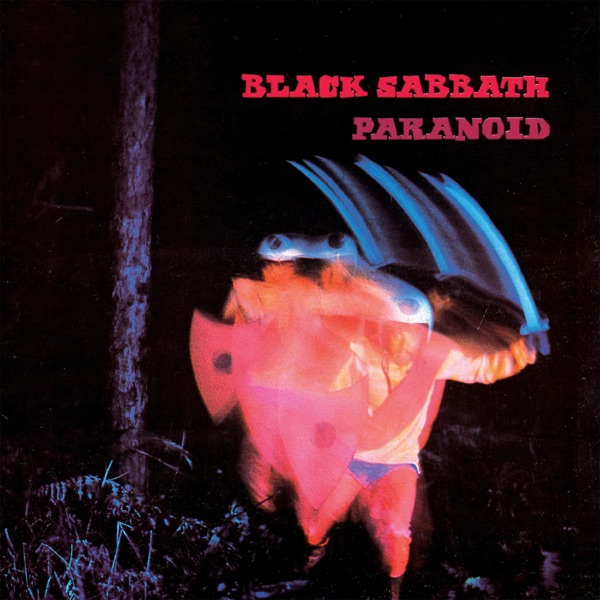
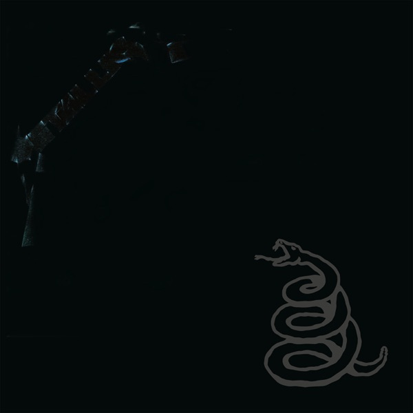
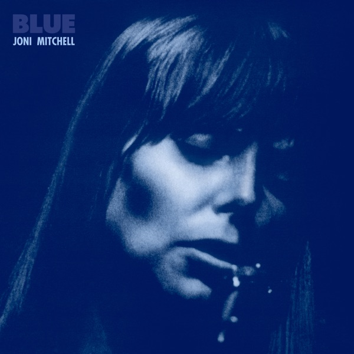
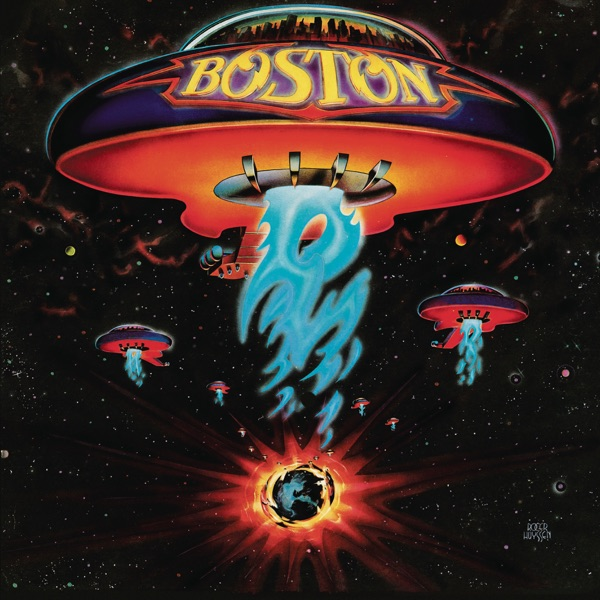
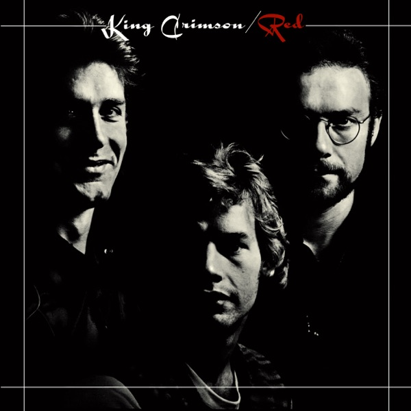
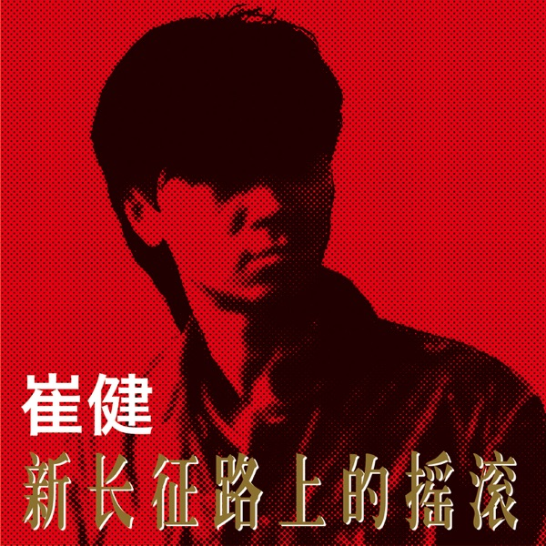

### 📻 Audioshow
presented by Audiofool

### 📻 Audioshow - EP_1

"Another hero, another mindless crime,
Behind the curtain, in the pantomime"

The Show Must Go On
- Queen
- Innuendo
- 1991
- Brian May, Roger Taylor, Freddie Mercury & John Deacon

### 📻 Audioshow - EP_2

"Ah, but I was so much older then
I am younger than that now"

My Back Pages (Live 10/16/1992)
- Bob Dylan, Roger McGuinn, Tom Petty, Neil Young, Eric Clapton & George Harrison
- Bob Dylan: The 30th Anniversary Concert Celebration
- 1993
- Bob Dylan

![EP_2_Bob Dylan_ The 30th Anniversary Concert Celebration (Deluxe Edition) \[2014 Remaster\]](<Covers/EP_2_Bob Dylan_ The 30th Anniversary Concert Celebration.jpg>)
### 📻 Audioshow - EP_3

"It's better to burn out than to fade away"

My My, Hey Hey (Out of the Blue)
- Neil Young & Crazy Horse
- Rust Never Sleeps
- 1979
- Jeff Blackburn & Neil Young

### 📻 Audioshow - EP_4

"Chain, keep us together"

The Chain
- Fleetwood Mac
- Rumours
- 1977
- Christine McVie, John McVie, Lindsey Buckingham, Mick Fleetwood & Stevie Nicks

### 📻 Audioshow - EP_5

"They call it paradise
I don't know why
You call someplace paradise
Kiss it goodbye"

The Last Resort
- Eagles
- Hotel California
- 1976
- Don Henley & Glenn Frey

### 📻 Audioshow - EP_6

"With every mistake, we must surely be learning
Still my guitar gently weeps"

While My Guitar Gently Weeps
- The Beatles
- The Beatles (The White Album)
- 1968
- George Harrison

.jpg>)

### 📻 Audioshow - EP_7

"Oh, by the way, which one's Pink?"

Have a Cigar
- Pink Floyd
- Wish You Were Here
- 1975
- Roger Waters

### 📻 Audioshow - EP_8

"And I think it's gonna be a long, long time
Till touchdown brings me 'round again to find"

Rocket Man (I Think It's Going to Be a Long Long Time)
- Elton John
- Honky Château
- 1972
- Elton John & Bernie Taupin

### 📻 Audioshow - EP_9

"Listening to the wind of change"

Wind of Change
- Scorpions
- Crazy World
- 1990
- Klaus Meine

### 📻 Audioshow - EP_10

"When the music's over
Turn out the lights"

When The Music's Over
- The Doors
- Strange Days
- 1967
- Jim Morrison, John Densmore, Ray Manzarek & Robby Krieger

### 📻 Audioshow - EP_11

"Every year is getting shorter, never seem to find the time
Plans that either come to naught or half a page of scibbled lines"

Time
- Pink Floyd
- The Dark Side of the Moon
- 1973
- Roger Waters, Nick Mason, Richard Wright & David Gilmour

### 📻 Audioshow - EP_12

"Still like that old time rock and roll"

Old Time Rock & Roll
- Bob Seger & The Silver Bullet Band
- Stranger In Town
- 1978
- George Henry Jackson & Thomas Earl Jones III

### 📻 Audioshow - EP_13

"Someone and someone were down by the pond
Looking for something to plant in the lawn"

Words (Between the Lines of Age)
- Neil Young
- Harvest
- 1972
- Neil Young

### 📻 Audioshow - EP_14

"Time is linear, memory's a stranger"

Perfect Sense, Pt. I
- Roger Waters
- Amused to Death
- 1992
- Roger Waters

### 📻 Audioshow - EP_15

"And be a simple kind of man  
Oh, be something you love and understand"

Simple Man
- Lynyrd Skynyrd
- Pronounced Leh-Nerd Skin-Nerd
- 1973
- Ronnie Van Zant & Gary Rossington

### 📻 Audioshow - EP_16

"We can be heroes, just for one day"

"Heroes"
- David Bowie
- "Heroes"
- 1977
- David Bowie & Brian Eno

### 📻 Audioshow - EP_17

"I have become comfortably numb"

Comfortably Numb
- Pink Floyd
- The Wall
- 1979
- Roger Waters & David Gilmour

### 📻 Audioshow - EP_18

"The night they drove old Dixie down
And the people were singing"

The Night They Drove Old Dixie Down
- The Band
- The Band
- 1969
- Robbie Robertson

### 📻 Audioshow - EP_19

"So Sally can wait
She knows it's too late as we're walking on by"
EP_20_Quadrophenia
Don't Look Back in Anger
- Oasis
- (What's the Story) Morning Glory?
- 1995
- Noel Gallagher

 Morning Glory.jpg>)

### 📻 Audioshow - EP_20

"Is it me, for a moment"

I Am the Sea
- The Who
- Quadrophenia
- 1973
- Pete Townshend

### 📻 Audioshow - EP_21

"Waterloo sunset's fine"

Waterloo Sunset
- The Kinks
- Something Else By the Kinks
- 1967
- Raymond Douglas Davies

### 📻 Audioshow - EP_22

"When all are one, and one is all
To be a rock and not to roll"

Stairway to Heaven
- Led Zeppelin
- Led Zeppelin IV
- 1971
- Jimmy Page & Robert Plant

### 📻 Audioshow - EP_23

"Starry, starry night
Portraits hung in empty halls
Frameless heads on nameless walls
With eyes that watch the world and can't forget"

Vincent
- Don Mclean
- American Pie
- 1971
- Don Mclean

### 📻 Audioshow - EP_24

"And I'll tell it, and speak it, and think it, and breathe it
And reflect from the mountain so all souls can see it
And I'll stand on the ocean until I start sinking
But I'll know my song well before I start singing"

A Hard Rain's A-Gonna Fall
- Bob Dylan
- The Freewheelin' Bob Dylan
- 1963
- Bob Dylan

### 📻 Audioshow - EP_25

"I am Iron Man"

Iron Man
- Black Sabbath
- Paranoid
- 1970
- Ozzy Osbourne, Tony Iommi & William Thomas Ward

### 📻 Audioshow - EP_26

"I need to be replenished, I need to overflow
Let my senses know your power, let your holy mix distill"

Ambrosia
- Carole King
- Thoroughbred
- 1976
- Carole King & David Palmer

### 📻 Audioshow - EP_27

"You know I believe and how"

Something
- The Beatles
- Abbey Road
- 1969
- George Harrison

### 📻 Audioshow - EP_28

"He says, 'Son, can you play me a memory?'
'I'm not really sure how it goes'"

Piano Man
- Billy Joel
- Piano Man
- 1973
- Billy Joel

### 📻 Audioshow - EP_29

"Thunder"

Thunderstruck
- AC/DC
- The Razors Edge
- 1990
- Angus Young & Malcolm Young

### 📻 Audioshow - EP_30

"I may be paranoid, but not an android"

Paranoid Android
- Radiohead
- OK Computer
- 1997
- Colin Greenwood, Ed O'Brien, Jonny Greenwood, Phil Selway & Thom Yorke

### 📻 Audioshow - EP_31

"What is the color when black is burned?"

I Am a Child
- Buffalo Springfield
- Last Time Around
- 1968
- Neil Young

### 📻 Audioshow - EP_32

"It is here
It is now"

It
- Genesis
- The Lamb Lies Down on Broadway
- 1974
- Mike Rutherford, Peter Gabriel, Phil Collins, Steve Hackett & Tony Banks

### 📻 Audioshow - EP_33

"Hiding on the backstreets
Hiding on the backstreets
Where we swore forever friends
On the backstreets until the end"

Backstreets
- Bruce Springsteen
- Born to Run
- 1975
- Bruce Springsteen

### 📻 Audioshow - EP_34

"It's a rainbow full of sound
It's fireworks, calliopes and clowns"

The Music Never Stopped
- Grateful Dead
- Blues for Allah
- 1975
- Bob Weir & John Barlow

### 📻 Audioshow - EP_35

"The paper holds their folded faces to the floor
And every day the paper boy brings more"

Brain Damage
- Roger Waters
- The Dark Side of the Moon Redux
- 2023
- Roger Waters

### 📻 Audioshow - EP_37

"You can't always get what you want
But if you try sometimes, you'll find you get what you need"

You Can't Always Get What You Want
- The Rolling Stones
- Let It Bleed
- 1969
- Mick Jagger & Keith Richards

### 📻 Audioshow - EP_38

"Destiny, reality are just a dream
Raise the sails, the wind is free"

Holiday
- Richard Wright
- Wet Dream
- 1978
- Richard Wright

### 📻 Audioshow - EP_39

"Sing with me, sing for the year
Sing for the laughter, sing for the tear"

Dream On
- Aerosmith
- Aerosmith
- 1973
- Steven Tyler

### 📻 Audioshow - EP_40

"Fly on, little wing"

Little Wing
- Derek & The Dominos
- Layla and Other Assorted Love Songs
- 1970
- Jimi Hendrix

### 📻 Audioshow - EP_41

"When I finally get myself together
I'm gonna get down in that sunny Southern weather"

Almost Cut My Hair
- Crosby, Stills, Nash & Young
- Déjà Vu
- 1970
- David Crosby

### 📻 Audioshow - EP_42

"We're just talkin' about the future
Forget about the past
It'll always be with us
It's never gonna die"

Rock and Roll Ain't Noise Pollution
- AC/DC
- Back In Black
- 1980
- Brian Johnson, Angus Young & Malcolm Young

### 📻 Audioshow - EP_43

"Never free
Never me
So I dub thee Unforgiven"

The Unforgiven
- Metallica
- Metallica
- 1991
- James Hetfield, Lars Ulrich & Kirk Hammett

### 📻 Audioshow - EP_44

"Deadlines and commitments
What to leave in, what to leave out"

Against the Wind
- Bob Seger & The Silver Bullet Band
- Against the Wind
- 1980
- Bob Seger

### 📻 Audioshow - EP_45

"Auqalung, my friend
Don't just start away uneasy
You poor old sod, you see, it's only me"

Aqualung
- Jethro Tull
- Aqualung
- 1971
- Ian Anderson & Jennie Anderson

### 📻 Audioshow - EP_46

"All the news of home you read
Just gives you the blues"

California
- Joni Mitchell
- Blue
- 1971
- Joni Mitchell

### 📻 Audioshow - EP_47

"Yesterday
All my troubles seemed so far away
Now it looks as though they're here to stay"

Yesterday
- The Beatles
- Help!
- 1965
- John Lennon & Paul McCartney

### 📻 Audioshow - EP_48

"Between the iron gates of fate
The seeds of time were sown"
And watered by the deeds of those
Who know and who are known"

Epitaph
- King Crimson
- In the Court of the Crimson King
- 1969
- Robert Fripp, Michael Giles, Greg Lake & Ian McDonald

### 📻 Audioshow - EP_49

"There's one more kid that'll never go to school
Never get to fall in love, never get to be cool"

Rockin' In the Free World
- Neil Young
- Freedom
- 1989
- Neil Young

### 📻 Audioshow - EP_50

"There are places I remember
All my life, though some have changed
Some forever, not for better
Some have gone and some remain"

In My Life
- The Beatles
- Rubber Soul
- 1965
- Paul McCartney & John Lennon

### 📻 Audioshow - EP_51

"Better keep on moving, Doolin-Dalton
'Til your shadow sets you free"

Doolin-Dalton
- Eagles
- Desperado
- 1973
- Don Henley, Glenn Frey, Jackson Browne, Jim Ed Norman & JD Souther

### 📻 Audioshow - EP_52

"Oh, let the sun beat down upon my face
With stars to fill my dream
I am a traveller of both time and space
To be where I have been"

Kashmir
- Led Zeppelin
- Physical Graffiti
- 1975
- Jimmy Page, John Bonham & Robert Plant

### 📻 Audioshow - EP_53

"Yesterday, there were so many things I was never shown
Suddenly this time I found I'm on the streets and I'm all alone"

Yesterdays
- Guns N' Roses
- Use Your Illusion II
- 1991
- Axl Rose, Jeffrey Isbell, Saul Hudson, Duff McKagan, Billy McCloud, West Arkeen & Del James

### 📻 Audioshow - EP_54

"There is a house in New Orleans
They call the Rising Sun"

The House of the Rising Sun
- The Animals
- The Singles Plus
- 1963
- Alan Price & Traditional

### 📻 Audioshow - EP_55

"And when the night is cloudy
There is still a light that shines on me
Shine on till tomorrow
Let it be"

Let It Be
- The Beatles
- Let It Be
- 1970
- John Lennon & Paul McCartney

### 📻 Audioshow - EP_56

"I'm lookin' for me
You're lookin' for you
We're lookin' at each other
And we don't know what to do"

The Seeker
- The Who
- Meaty, Beaty, Big and Bouncy
- 1970
- Pete Townshend

### 📻 Audioshow - EP_57

"Strangers passing in the street
By chance two separate glances meet
And I am you and what I see is me"

Echoes
- Pink Floyd
- Meddle
- 1970
- Roger Waters, David Gilmour, Richard Wright & Nick Mason

### 📻 Audioshow - EP_58

"Can you picture what will be?
So limitless and free
Desperately in need
Of some stranger's hand
In a desperate land"

The End
- The Doors
- The Doors
- 1967
- Jim Morrison, John Densmore, Ray Manzarek & Robby Krieger

### 📻 Audioshow - EP_59

"Free at last, they took your life
They could not take your pride"

Pride (In the Name of Love)
- U2
- The Unforgettable Fire
- 1984
- The Edge, Bono, Adam Clayton & Larry Mullen Jr.

### 📻 Audioshow - EP_60

"Sunshine is far away, clouds linger on"

Solitude
- Black Sabbath
- Master of Reality
- 1971
- Bill Ward, Ozzy Osbourne, Geezer Butler & Tony Iommi

### 📻 Audioshow - EP_61

"Ashes and diamonds
Foe and friend
We were all equal in the end"

Two Suns In the Sunset
- Pink Floyd
- The Final Cut
- 1983
- Roger Waters

### 📻 Audioshow - EP_62

"Sunburn with freezerburn
Choking on the ashes of her enemy"

All Apologies
- Nirvana
- In Utero
- 1993
- Kurt Cobain

### 📻 Audioshow - EP_63

"I'm playing my role in history
Looking to find my goal
Taking in all this misery
But giving in all my soul"

Made in Heaven
- Freddie Mercury
- Mr. Bad Guy
- 1985
- Freddie Mercury

### 📻 Audioshow - EP_64

"We stand to lose all time
A thousand answers by in our hand
Next to your deeper fears
We stand surrounded by a million years"

Roundabout
- Yes
- Fragile
- 1971
- Jon Anderson & Steve Howe

### 📻 Audioshow - EP_65

"Home, home again
I like to be here when I can
When I come home cold and tired
It's good to warm my bones beside the fire"

Breathe (Reprise)
- Roger Waters
- Us + Them
- 2020
- Roger Waters, David Gilmour & Richard Wright

### 📻 Audioshow - EP_66

"The temple's in ruins
The bankers get fat
The buffalo's gone
And the mountain top's flat"

Déjà Vu
- Roger Waters
- Is This the Life We Really Want?
- 2017
- Roger Waters

### 📻 Audioshow - EP_67

"Blind man running through the light of the night
With an answer in his hand
Come on down to the river of sight
And you can really understand"

Don't Let It Bring You Down
- Neil Young
- After the Gold Rush
- 1970
- Neil Young

### 📻 Audioshow - EP_68

"May your heart always be joyful
May your song always be sung
And may you stay, forever young"

Forever Young
- Bob Dylan
- Planet Waves
- 1974
- Bob Dylan

### 📻 Audioshow - EP_69

"Don't put me in a frame upon the mantel
'Fore memories turn dusty old and grey
Don't leave me alone in the twilight
Twilight is the loneliest time a day"

Twilight
- The Band
- The Best of The Band
- 1976
- Robbie Robertson

### 📻 Audioshow - EP_70

[Instrumental]

Beck's Bolero
- Jeff Beck
- Truth
- 1968
- Jimmy Page

### 📻 Audioshow - EP_71

"I heard telephones, opera house, favourite melodies
I saw boys, toys, electric irons and TVs
My brain hurt like a warehouse, it had no room to spare
I had to cram so many things to store everything in there"

Five Years
- David Bowie
- The Rise and Fall of Ziggy Stardust and the Spiders from Mars
- 1972
- David Bowie

### 📻 Audioshow - EP_72

"When the flames have their season
Will you hold to your reason?
Loaded down with your talents
Can you still keep your balance?
Can you live on a knife-edge?"

Knife-Edge
- Emerson, Lake & Palmer
- Emerson, Lake & Palmer
- 1970
- Leoš Janáček & Johann Sebastian Bach

### 📻 Audioshow - EP_73

"This bleeding heart's (Waiting for the waves)
Not beating much (To break)"

Wearing the Inside Out
- Pink Floyd
- The Division Bell
- 1994
- Richard Wright

### 📻 Audioshow - EP_74

"When the seas and mountains fall
And we come to end of days
In the dark I hear a call
Calling me there
I will go there
And back again"

The Road Goes Ever On..., Pt. 2 / "In Dreams"
- Howard Shore
- The Lord of the Rings: The Fellowship of the Ring - The Complete Recordings
- 2005
- Howard Shore & Fran Walsh

### 📻 Audioshow - EP_75

"You don't need a weatherman to know which way the wind blows"

Subterranean Homesick Blues
- Bob Dylan
- Bringing It All Back Home
- 1965
- Bob Dylan

### 📻 Audioshow - EP_76

"I understand about indecision
But I don't care if I get behind
People living in competition
All I want is to have my peace of mind"

Peace of Mind
- Boston
- Boston
- 1976
- T. Scholz

### 📻 Audioshow - EP_77

"Again, the morning's come
Again, he's on the run
A sunbeam shinin' through his hair
Fear not to have a care
Well pick up your gear and gypsy roll on
Roll on"

Melissa
- The Allman Brothers Band
- Eat a Peach
- 1972
- Gregg Allman & Steve Alaimo

### 📻 Audioshow - EP_78

"Knock, knock, knockin' on Heaven's door
Knock, knock, knockin' on Heaven's door
Knock, knock, knockin' on Heaven's door
Knock, knock, knockin' on Heaven's door"

Knockin' On Heaven's Door
- Bob Dylan
- Pat Garrett & Billy the Kid [Soundtrack from the Motion Picture]
- 1973
- Bob Dylan

![EP_78_Pat Garrett & Billy the Kid  [Soundtrack from the Motion Picture]](<Covers/EP_78_Pat Garrett & Billy the Kid  [Soundtrack from the Motion Picture].jpg>)

### 📻 Audioshow - EP_79

"The spotlight fades
The boys disband
The final notes lie mute upon the sand
And in the silence
Of the grave
I can still hear those lost boys calling"

Lost Boys Calling
- Roger Waters & Eddie Van Halen
- The Legend of 1900
- 1998
- Ennio Morricone

### 📻 Audioshow - EP_80

"Sweet home Alabama
Where the skies are so blue
Sweet home Alabama
Lord, I'm coming home to you"

Sweet Home Alabama
- Lynyrd Skynyrd
- Second Helping
- 1974
- Gary Rossington, Ronnie Van Zant & Edward King

### 📻 Audioshow - EP_81

"It's almost a feeling you can touch in the air
You look all around you, but nobody's there
It's been a long time now since you've been aware
That someone is watching you (he's gonna get you)"

The Voice
- The Alan Parsons Project
- I Robot
- 1977
- Eric Woolfson & Alan Parsons

### 📻 Audioshow - EP_82

"Juliet, the dice was loaded from the start
And I bet, when you exploded into my heart
And I forget, I forget, the movie song
When you gonna realize, it was just that the time was wrong, Juliet?"

Romeo and Juliet
- Dire Straits
- Making Movies
- 1980
- Mark Knopfler

### 📻 Audioshow - EP_83

"Faith, you're driving me away
You do it everyday
You don't mean it, but it hurts like hell
My brain says I'm receiving pain
A lack of oxygen from my life support
My iron lung"

My Iron Lung
- Radiohead
- The Bends
- 1980
- Colin Greenwood, Ed O'Brien, Jonny Greenwood, Phil Selway & Thom Yorke

### 📻 Audioshow - EP_84

"Who knows? Only time"

Only Time
- Enya
- A Day Without Rain
- 2000
- Eith Ni-Bhraonain, Nicholas Ryan, Enya & Roma Ryan

### 📻 Audioshow - EP_85

"Somewhere on a desert highway
She rides a Harley-Davidson"

Unknown Legend
- Neil Young
- Harvest Moon
- 1992
- Neil Young

### 📻 Audioshow - EP_86

"When my fist clenches, crack it open
Before I use it and lose my cool
When I smile, tell me some bad news
Before I laugh and act like a fool"

Behind Blue Eyes
- The Who
- Who's Next
- 1971
- Pete Townshend

### 📻 Audioshow - EP_87

"Watch out
The world's behind you
There's always someone around you who will call
It's nothing at all"

Sunday Morning
- The Velvet Underground & Nico
- The Velvet Underground & Nico
- 1966
- Lou Reed & John Cale

### 📻 Audioshow - EP_88

"I can see
My rainbow calling me
Through the misty breeze
Of my waterfall"

May This Be Love
- The Jimi Hendrix Experience
- Are You Experienced
- 1967
- Jimi Hendrix

### 📻 Audioshow - EP_89

"Come ride with me through the veins of history
I'll show you a god who falls asleep on the job
And how can we win when fools can be kings?
Don't waste your time, or time will waste you"

Knights of Cydonia
- Muse
- Black Holes and Revelations
- 2006
- Matthew Bellamy

### 📻 Audioshow - EP_90

"Keep on playin' those mind games forever
Raisin' the spirit 
Of peace and love"

Mind Games
- John Lennon
- Mind Games
- 1973
- John Lennon

### 📻 Audioshow - EP_91

"Who needs information
When you're workin' underground?
Just give me confirmation
We could win a million pounds"

Who Needs Information
- Roger Waters
- Radio K.A.O.S.
- 1987
- Roger Waters

### 📻 Audioshow - EP_92

"Westside skyline crying
Fallen angel dying
Risk a life to make a dime"

Fallen Angel
- King Crimson
- Red
- 1974
- Robert Fripp, John Wetton

### 📻 Audioshow - EP_93

"我不愿离开 我不愿存在
我不愿活得过分实实在在
我想要离开 我想要存在
我想要死去之后从头再来"

从头再来
- 崔健
- 新长征路上的摇滚
- 1989
- 崔健

### 📻 Audioshow - EP_94

"Slow down, you crazy child
And take the phone off the hook and disappear for a while
It’s alright, you can afford to lose a day or two, ooh
When will you realize?
Vienna waits for you"

Vienna
- Billy Joel
- The Stranger
- 1977
- Billy Joel, Patrick Williams

