# 📻 Audioshow
presented by Audiofool

### 📻 Audioshow - EP_1

"Another hero, another mindless crime,
Behind the curtain, in the pantomime"

The Show Must Go On
- Queen
- Innuendo
- 1991
- Brian May, Roger Taylor, Freddie Mercury & John Deacon

### 📻 Audioshow - EP_2

"Ah, but I was so much older then
I am younger than that now"

My Back Pages (Live 10/16/1992)
- Bob Dylan, Roger McGuinn, Tom Petty, Neil Young, Eric Clapton & George Harrison
- Bob Dylan: The 30th Anniversary Concert Celebration
- 1993
- Bob Dylan

### 📻 Audioshow - EP_3

"It's better to burn out than to fade away"

My My, Hey Hey (Out of the Blue)
- Neil Young & Crazy Horse
- Rust Never Sleeps
- 1979
- Jeff Blackburn & Neil Young

### 📻 Audioshow - EP_4

"Chain, keep us together"

The Chain
- Fleetwood Mac
- Rumours
- 1977
- Christine McVie, John McVie, Lindsey Buckingham, Mick Fleetwood & Stevie Nicks

### 📻 Audioshow - EP_5

"They call it paradise
I don't know why
You call someplace paradise
Kiss it goodbye"

The Last Resort
- Eagles
- Hotel California
- 1976
- Don Henley & Glenn Frey

### 📻 Audioshow - EP_6

"With every mistake, we must surely be learning
Still my guitar gently weeps"

While My Guitar Gently Weeps
- The Beatles
- The Beatles (The White Album)
- 1968
- George Harrison

.jpg>)

### 📻 Audioshow - EP_7

"Oh, by the way, which one's Pink?"

Have a Cigar
- Pink Floyd
- Wish You Were Here
- 1975
- Roger Waters

### 📻 Audioshow - EP_8

"And I think it's gonna be a long, long time
Till touchdown brings me 'round again to find"

Rocket Man (I Think It's Going to Be a Long Long Time)
- Elton John
- Honky Château
- 1972
- Elton John & Bernie Taupin

### 📻 Audioshow - EP_9

"Listening to the wind of change"

Wind of Change
- Scorpions
- Crazy World
- 1990
- Klaus Meine

### 📻 Audioshow - EP_10

"When the music's over
Turn out the lights"

When The Music's Over
- The Doors
- Strange Days
- 1967
- Jim Morrison, John Densmore, Ray Manzarek & Robby Krieger

### 📻 Audioshow - EP_11

"Every year is getting shorter, never seem to find the time
Plans that either come to naught or half a page of scibbled lines"

Time
- Pink Floyd
- The Dark Side of the Moon
- 1973
- Roger Waters, Nick Mason, Richard Wright & David Gilmour

### 📻 Audioshow - EP_12

"Still like that old time rock and roll"

Old Time Rock & Roll
- Bob Seger & The Silver Bullet Band
- Stranger In Town
- 1978
- George Henry Jackson & Thomas Earl Jones III

### 📻 Audioshow - EP_13

"Someone and someone were down by the pond
Looking for something to plant in the lawn"

Words (Between the Lines of Age)
- Neil Young
- Harvest
- 1972
- Neil Young

### 📻 Audioshow - EP_14

"Time is linear, memory's a stranger"

Perfect Sense, Pt. I
- Roger Waters
- Amused to Death
- 1992
- Roger Waters

### 📻 Audioshow - EP_15

"And be a simple kind of man  
Oh, be something you love and understand"

Simple Man
- Lynyrd Skynyrd
- Pronounced Leh-Nerd Skin-Nerd
- 1973
- Ronnie Van Zant & Gary Rossington

### 📻 Audioshow - EP_16

"We can be heroes, just for one day"

"Heroes"
- David Bowie
- "Heroes"
- 1977
- David Bowie & Brian Eno

### 📻 Audioshow - EP_17

"I have become comfortably numb"

Comfortably Numb
- Pink Floyd
- The Wall
- 1979
- Roger Waters & David Gilmour

### 📻 Audioshow - EP_18

"The night they drove old Dixie down
And the people were singing"

The Night They Drove Old Dixie Down
- The Band
- The Band
- 1969
- Robbie Robertson

### 📻 Audioshow - EP_19

"So Sally can wait
She knows it's too late as we're walking on by"
EP_20_Quadrophenia
Don't Look Back in Anger
- Oasis
- (What's the Story) Morning Glory?
- 1995
- Noel Gallagher

 Morning Glory.jpg>)

### 📻 Audioshow - EP_20

"Is it me, for a moment"

I Am the Sea
- The Who
- Quadrophenia
- 1973
- Pete Townshend

### 📻 Audioshow - EP_21

"Waterloo sunset's fine"

Waterloo Sunset
- The Kinks
- Something Else By the Kinks
- 1967
- Raymond Douglas Davies

### 📻 Audioshow - EP_22

"When all are one, and one is all
To be a rock and not to roll"

Stairway to Heaven
- Led Zeppelin
- Led Zeppelin IV
- 1971
- Jimmy Page & Robert Plant

### 📻 Audioshow - EP_23

"Starry, starry night
Portraits hung in empty halls
Frameless heads on nameless walls
With eyes that watch the world and can't forget"

Vincent
- Don Mclean
- American Pie
- 1971
- Don Mclean

### 📻 Audioshow - EP_24

"And I'll tell it, and speak it, and think it, and breathe it
And reflect from the mountain so all souls can see it
And I'll stand on the ocean until I start sinking
But I'll know my song well before I start singing"

A Hard Rain's A-Gonna Fall
- Bob Dylan
- The Freewheelin' Bob Dylan
- 1963
- Bob Dylan

### 📻 Audioshow - EP_25

"I am Iron Man"

Iron Man
- Black Sabbath
- Paranoid
- 1970
- Ozzy Osbourne, Tony Iommi & William Thomas Ward

### 📻 Audioshow - EP_26

"I need to be replenished, I need to overflow
Let my senses know your power, let your holy mix distill"

Ambrosia
- Carole King
- Thoroughbred
- 1976
- Carole King & David Palmer

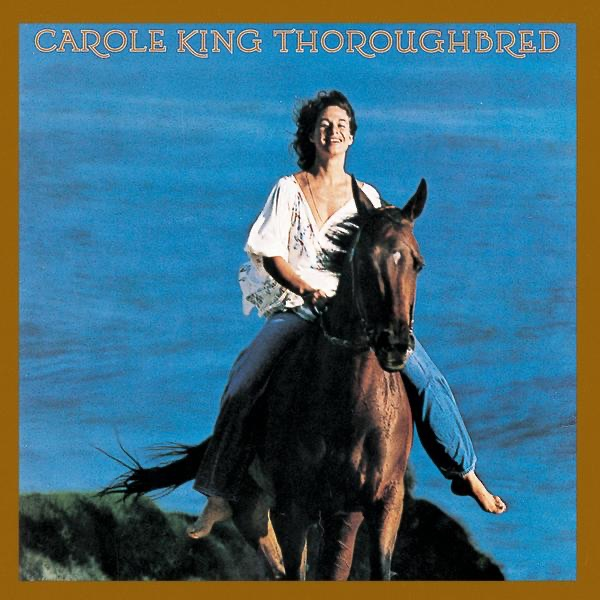

### 📻 Audioshow - EP_27

"You know I believe and how"

Something
- The Beatles
- Abbey Road
- 1969
- George Harrison

### 📻 Audioshow - EP_28

"He says, 'Son, can you play me a memory?'
'I'm not really sure how it goes'"

Piano Man
- Billy Joel
- Piano Man
- 1973
- Billy Joel

### 📻 Audioshow - EP_29

"Thunder"

Thunderstruck
- AC/DC
- The Razors Edge
- 1990
- Angus Young & Malcolm Young

### 📻 Audioshow - EP_30

"I may be paranoid, but not an android"

Paranoid Android
- Radiohead
- 4Computer
- 1997
- Colin Greenwood, Ed O'Brien, Jonny Greenwood, Phil Selway & Thom Yorke

### 📻 Audioshow - EP_31

"What is the color when black is burned?"

I Am a Child
- Buffalo Springfield
- Last Time Around
- 1968
- Neil Young

### 📻 Audioshow - EP_32

"It is here
It is now"

It
- Genesis
- The Lamb Lies Down on Broadway
- 1974
- Mike Rutherford, Peter Gabriel, Phil Collins, Steve Hackett & Tony Banks

### 📻 Audioshow - EP_33

"Hiding on the backstreets
Hiding on the backstreets
Where we swore forever friends
On the backstreets until the end"

Backstreets
- Bruce Springsteen
- Born to Run
- 1975
- Bruce Springsteen

### 📻 Audioshow - EP_34

"It's a rainbow full of sound
It's fireworks, calliopes and clowns"

The Music Never Stopped
- Grateful Dead
- Blues for Allah
- 1975
- Bob Weir & John Barlow

### 📻 Audioshow - EP_35

"The paper holds their folded faces to the floor
And every day the paper boy brings more"

Brain Damage
- Roger Waters
- The Dark Side of the Moon Redux
- 2023
- Roger Waters

### 📻 Audioshow - EP_36

"Lucifer Sam, Siam cat
Always sitting by your side
Always by your side
That cat's something I can't explain"

Lucifer Sam
- Pink Floyd
- The Piper at the Gates of Dawn
- 1967
- Syd Barrett

### 📻 Audioshow - EP_37

"You can't always get what you want
But if you try sometimes, you'll find you get what you need"

You Can't Always Get What You Want
- The Rolling Stones
- Let It Bleed
- 1969
- Mick Jagger & Keith Richards

### 📻 Audioshow - EP_38

"Destiny, reality are just a dream
Raise the sails, the wind is free"

Holiday
- Richard Wright
- Wet Dream
- 1978
- Richard Wright

### 📻 Audioshow - EP_39

"Sing with me, sing for the year
Sing for the laughter, sing for the tear"

Dream On
- Aerosmith
- Aerosmith
- 1973
- Steven Tyler

### 📻 Audioshow - EP_40

"Fly on, little wing"

Little Wing
- Derek & The Dominos
- Layla and Other Assorted Love Songs
- 1970
- Jimi Hendrix

### 📻 Audioshow - EP_41

"When I finally get myself together
I'm gonna get down in that sunny Southern weather"

Almost Cut My Hair
- Crosby, Stills, Nash & Young
- Déjà Vu
- 1970
- David Crosby

### 📻 Audioshow - EP_42

"We're just talkin' about the future
Forget about the past
It'll always be with us
It's never gonna die"

Rock and Roll Ain't Noise Pollution
- AC/DC
- Back In Black
- 1980
- Brian Johnson, Angus Young & Malcolm Young

### 📻 Audioshow - EP_43

"Never free
Never me
So I dub thee Unforgiven"

The Unforgiven
- Metallica
- Metallica
- 1991
- James Hetfield, Lars Ulrich & Kirk Hammett

### 📻 Audioshow - EP_44

"Deadlines and commitments
What to leave in, what to leave out"

Against the Wind
- Bob Seger & The Silver Bullet Band
- Against the Wind
- 1980
- Bob Seger

### 📻 Audioshow - EP_45

"Auqalung, my friend
Don't just start away uneasy
You poor old sod, you see, it's only me"

Aqualung
- Jethro Tull
- Aqualung
- 1971
- Ian Anderson & Jennie Anderson

### 📻 Audioshow - EP_46

"All the news of home you read
Just gives you the blues"

California
- Joni Mitchell
- Blue
- 1971
- Joni Mitchell

### 📻 Audioshow - EP_47

"Yesterday
All my troubles seemed so far away
Now it looks as though they're here to stay"

Yesterday
- The Beatles
- Help!
- 1965
- John Lennon & Paul McCartney

### 📻 Audioshow - EP_48

"Between the iron gates of fate
The seeds of time were sown
And watered by the deeds of those
Who know and who are known"

Epitaph
- King Crimson
- In the Court of the Crimson King
- 1969
- Robert Fripp, Michael Giles, Greg Lake & Ian McDonald

### 📻 Audioshow - EP_49

"There's one more kid that'll never go to school
Never get to fall in love, never get to be cool"

Rockin' In the Free World
- Neil Young
- Freedom
- 1989
- Neil Young

### 📻 Audioshow - EP_50

"There are places I remember
All my life, though some have changed
Some forever, not for better
Some have gone and some remain"

In My Life
- The Beatles
- Rubber Soul
- 1965
- Paul McCartney & John Lennon

### 📻 Audioshow - EP_51

"Better keep on moving, Doolin-Dalton
'Til your shadow sets you free"

Doolin-Dalton
- Eagles
- Desperado
- 1973
- Don Henley, Glenn Frey, Jackson Browne, Jim Ed Norman & JD Souther

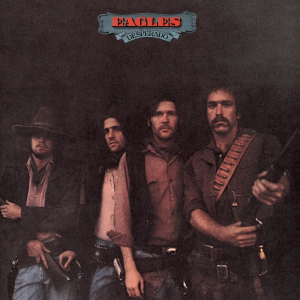

### 📻 Audioshow - EP_52

"Oh, let the sun beat down upon my face
With stars to fill my dream
I am a traveller of both time and space
To be where I have been"

Kashmir
- Led Zeppelin
- Physical Graffiti
- 1975
- Jimmy Page, John Bonham & Robert Plant

### 📻 Audioshow - EP_53

"Yesterday, there were so many things I was never shown
Suddenly this time I found I'm on the streets and I'm all alone"

Yesterdays
- Guns N' Roses
- Use Your Illusion II
- 1991
- Axl Rose, Jeffrey Isbell, Saul Hudson, Duff McKagan, Billy McCloud, West Arkeen & Del James

### 📻 Audioshow - EP_54

"There is a house in New Orleans
They call the Rising Sun"

The House of the Rising Sun
- The Animals
- The Singles Plus
- 1963
- Alan Price & Traditional

### 📻 Audioshow - EP_55

"And when the night is cloudy
There is still a light that shines on me
Shine on till tomorrow
Let it be"

Let It Be
- The Beatles
- Let It Be
- 1970
- John Lennon & Paul McCartney

### 📻 Audioshow - EP_56

"I'm lookin' for me
You're lookin' for you
We're lookin' at each other
And we don't know what to do"

The Seeker
- The Who
- Meaty, Beaty, Big and Bouncy
- 1970
- Pete Townshend

### 📻 Audioshow - EP_57

"Strangers passing in the street
By chance two separate glances meet
And I am you and what I see is me"

Echoes
- Pink Floyd
- Meddle
- 1970
- Roger Waters, David Gilmour, Richard Wright & Nick Mason

### 📻 Audioshow - EP_58

"Can you picture what will be?
So limitless and free
Desperately in need
Of some stranger's hand
In a desperate land"

The End
- The Doors
- The Doors
- 1967
- Jim Morrison, John Densmore, Ray Manzarek & Robby Krieger

### 📻 Audioshow - EP_59

"Free at last, they took your life
They could not take your pride"

Pride (In the Name of Love)
- U2
- The Unforgettable Fire
- 1984
- The Edge, Bono, Adam Clayton & Larry Mullen Jr.

### 📻 Audioshow - EP_60

"Sunshine is far away, clouds linger on"

Solitude
- Black Sabbath
- Master of Reality
- 1971
- Bill Ward, Ozzy Osbourne, Geezer Butler & Tony Iommi

### 📻 Audioshow - EP_61

"Ashes and diamonds
Foe and friend
We were all equal in the end"

Two Suns In the Sunset
- Pink Floyd
- The Final Cut
- 1983
- Roger Waters

### 📻 Audioshow - EP_62

"Sunburn with freezerburn
Choking on the ashes of her enemy"

All Apologies
- Nirvana
- In Utero
- 1993
- Kurt Cobain

### 📻 Audioshow - EP_63

"I'm playing my role in history
Looking to find my goal
Taking in all this misery
But giving in all my soul"

Made in Heaven
- Freddie Mercury
- Mr. Bad Guy
- 1985
- Freddie Mercury

### 📻 Audioshow - EP_64

"We stand to lose all time
A thousand answers by in our hand
Next to your deeper fears
We stand surrounded by a million years"

Roundabout
- Yes
- Fragile
- 1971
- Jon Anderson & Steve Howe

### 📻 Audioshow - EP_65

"Home, home again
I like to be here when I can
When I come home cold and tired
It's good to warm my bones beside the fire"

Breathe (Reprise)
- Roger Waters
- Us + Them
- 2020
- Roger Waters, David Gilmour & Richard Wright

### 📻 Audioshow - EP_66

"The temple's in ruins
The bankers get fat
The buffalo's gone
And the mountain top's flat"

Déjà Vu
- Roger Waters
- Is This the Life We Really Want?
- 2017
- Roger Waters

### 📻 Audioshow - EP_67

"Blind man running through the light of the night
With an answer in his hand
Come on down to the river of sight
And you can really understand"

Don't Let It Bring You Down
- Neil Young
- After the Gold Rush
- 1970
- Neil Young

### 📻 Audioshow - EP_68

"May your heart always be joyful
May your song always be sung
And may you stay, forever young"

Forever Young
- Bob Dylan
- Planet Waves
- 1974
- Bob Dylan

### 📻 Audioshow - EP_69

"Don't put me in a frame upon the mantel
'Fore memories turn dusty old and grey
Don't leave me alone in the twilight
Twilight is the loneliest time a day"

Twilight
- The Band
- The Best of The Band
- 1976
- Robbie Robertson

### 📻 Audioshow - EP_70

[Instrumental]

Beck's Bolero
- Jeff Beck
- Truth
- 1968
- Jimmy Page

### 📻 Audioshow - EP_71

"I heard telephones, opera house, favourite melodies
I saw boys, toys, electric irons and TVs
My brain hurt like a warehouse, it had no room to spare
I had to cram so many things to store everything in there"

Five Years
- David Bowie
- The Rise and Fall of Ziggy Stardust and the Spiders from Mars
- 1972
- David Bowie

### 📻 Audioshow - EP_72

"When the flames have their season
Will you hold to your reason?
Loaded down with your talents
Can you still keep your balance?
Can you live on a knife-edge?"

Knife-Edge
- Emerson, Lake & Palmer
- Emerson, Lake & Palmer
- 1970
- Leoš Janáček & Johann Sebastian Bach

### 📻 Audioshow - EP_73

"This bleeding heart's (Waiting for the waves)
Not beating much (To break)"

Wearing the Inside Out
- Pink Floyd
- The Division Bell
- 1994
- Richard Wright

### 📻 Audioshow - EP_74

"When the seas and mountains fall
And we come to end of days
In the dark I hear a call
Calling me there
I will go there
And back again"

The Road Goes Ever On..., Pt. 2 / "In Dreams"
- Howard Shore
- The Lord of the Rings: The Fellowship of the Ring - The Complete Recordings
- 2005
- Howard Shore & Fran Walsh

### 📻 Audioshow - EP_75

"You don't need a weatherman to know which way the wind blows"

Subterranean Homesick Blues
- Bob Dylan
- Bringing It All Back Home
- 1965
- Bob Dylan

### 📻 Audioshow - EP_76

"I understand about indecision
But I don't care if I get behind
People living in competition
All I want is to have my peace of mind"

Peace of Mind
- Boston
- Boston
- 1976
- T. Scholz

### 📻 Audioshow - EP_77

"Again, the morning's come
Again, he's on the run
A sunbeam shinin' through his hair
Fear not to have a care
Well pick up your gear and gypsy roll on
Roll on"

Melissa
- The Allman Brothers Band
- Eat a Peach
- 1972
- Gregg Allman & Steve Alaimo

### 📻 Audioshow - EP_78

"Knock, knock, knockin' on Heaven's door
Knock, knock, knockin' on Heaven's door
Knock, knock, knockin' on Heaven's door
Knock, knock, knockin' on Heaven's door"

Knockin' On Heaven's Door
- Bob Dylan
- Pat Garrett & Billy the Kid [Soundtrack from the Motion Picture]
- 1973
- Bob Dylan

![EP_78_Pat Garrett & Billy the Kid  [Soundtrack from the Motion Picture]](<Covers/EP_51-100/EP_78_Pat Garrett & Billy the Kid  [Soundtrack from the Motion Picture].jpg>)

### 📻 Audioshow - EP_79

"The spotlight fades
The boys disband
The final notes lie mute upon the sand
And in the silence
Of the grave
I can still hear those lost boys calling"

Lost Boys Calling
- Roger Waters & Eddie Van Halen
- The Legend of 1900
- 1998
- Ennio Morricone

### 📻 Audioshow - EP_80

"Sweet home Alabama
Where the skies are so blue
Sweet home Alabama
Lord, I'm coming home to you"

Sweet Home Alabama
- Lynyrd Skynyrd
- Second Helping
- 1974
- Gary Rossington, Ronnie Van Zant & Edward King

### 📻 Audioshow - EP_81

"It's almost a feeling you can touch in the air
You look all around you, but nobody's there
It's been a long time now since you've been aware
That someone is watching you (he's gonna get you)"

The Voice
- The Alan Parsons Project
- I Robot
- 1977
- Eric Woolfson & Alan Parsons

### 📻 Audioshow - EP_82

"Juliet, the dice was loaded from the start
And I bet, when you exploded into my heart
And I forget, I forget, the movie song
When you gonna realize, it was just that the time was wrong, Juliet?"

Romeo and Juliet
- Dire Straits
- Making Movies
- 1980
- Mark Knopfler

### 📻 Audioshow - EP_83

"Faith, you're driving me away
You do it everyday
You don't mean it, but it hurts like hell
My brain says I'm receiving pain
A lack of oxygen from my life support
My iron lung"

My Iron Lung
- Radiohead
- The Bends
- 1980
- Colin Greenwood, Ed O'Brien, Jonny Greenwood, Phil Selway & Thom Yorke

### 📻 Audioshow - EP_84

"Who knows? Only time"

Only Time
- Enya
- A Day Without Rain
- 2000
- Eith Ni-Bhraonain, Nicholas Ryan, Enya & Roma Ryan

### 📻 Audioshow - EP_85

"Somewhere on a desert highway
She rides a Harley-Davidson"

Unknown Legend
- Neil Young
- Harvest Moon
- 1992
- Neil Young

### 📻 Audioshow - EP_86

"When my fist clenches, crack it open
Before I use it and lose my cool
When I smile, tell me some bad news
Before I laugh and act like a fool"

Behind Blue Eyes
- The Who
- Who's Next
- 1971
- Pete Townshend

### 📻 Audioshow - EP_87

"Watch out
The world's behind you
There's always someone around you who will call
It's nothing at all"

Sunday Morning
- The Velvet Underground & Nico
- The Velvet Underground & Nico
- 1966
- Lou Reed & John Cale

### 📻 Audioshow - EP_88

"I can see
My rainbow calling me
Through the misty breeze
Of my waterfall"

May This Be Love
- The Jimi Hendrix Experience
- Are You Experienced
- 1967
- Jimi Hendrix

### 📻 Audioshow - EP_89

"Come ride with me through the veins of history
I'll show you a god who falls asleep on the job
And how can we win when fools can be kings?
Don't waste your time, or time will waste you"

Knights of Cydonia
- Muse
- Black Holes and Revelations
- 2006
- Matthew Bellamy

### 📻 Audioshow - EP_90

"Keep on playin' those mind games forever
Raisin' the spirit 
Of peace and love"

Mind Games
- John Lennon
- Mind Games
- 1973
- John Lennon

### 📻 Audioshow - EP_91

"Who needs information
When you're workin' underground?
Just give me confirmation
We could win a million pounds"

Who Needs Information
- Roger Waters
- Radio K.A.O.S.
- 1987
- Roger Waters

### 📻 Audioshow - EP_92

"Westside skyline crying
Fallen angel dying
Risk a life to make a dime"

Fallen Angel
- King Crimson
- Red
- 1974
- Robert Fripp, John Wetton

### 📻 Audioshow - EP_93

"我不愿离开 我不愿存在
我不愿活得过分实实在在
我想要离开 我想要存在
我想要死去之后从头再来"

从头再来
- 崔健
- 新长征路上的摇滚
- 1989
- 崔健

### 📻 Audioshow - EP_94

"Slow down, you crazy child
And take the phone off the hook and disappear for a while
It’s alright, you can afford to lose a day or two, ooh
When will you realize?
Vienna waits for you"

Vienna
- Billy Joel
- The Stranger
- 1977
- Billy Joel, Patrick Williams

### 📻 Audioshow - EP_95

"'Follow me down to the valley below
You know
Moonlight is bleeding from out of your soul'"

Lazarus
- Porcupine Tree
- Deadwing
- 2005
- Steven John Wilson, Richard Barbieri, Colin Edwin Balch & Gavin Richard Harrison

### 📻 Audioshow - EP_96

"Sweet child in time
You'll see the line
The line that's drawn between
Good and bad"

Child In Time
- Deep Purple
- Deep Purple In Rock
- 1970
- Ian Gillan, Ian Paice, Jon Lord, Ritchie Blackmore & Roger Glover

### 📻 Audioshow - EP_97

"As far as my eyes can see"

Old and Wise
- The Alan Parsons Project
- Eye In the Sky
- 1982
- Eric Woolfson & Alan Parsons

### 📻 Audioshow - EP_98

"Know when you see him
Nothing can free him
Step aside, open wide
It's the loner"

The Loner
- Neil Young
- Neil Young
- 1968
- Neil Young

### 📻 Audioshow - EP_99

"Now that your rose is in bloom
A light hits the gloom on the gray"

Kiss from a Rose
- Seal
- Seal II
- 1994
- Henry Samuel

### 📻 Audioshow - EP_100

"You may say I'm a dreamer
But I'm not the only one
I hope someday you'll join us
And the world will be as one"

Imagine
- John Lennon
- Imagine
- 1971
- John Lennon & Yoko Ono

### 📻 Audioshow - EP_101

"Find the cost of freedom buried in the ground
Mother Earth will swallow you, lay your body down"

Find the Cost of Freedom
- Crosby, Stills, Nash & Young
- So Far
- 1971
- Stephen Stills

### 📻 Audioshow - EP_102

"Well, like a bad penny spins around and around
Well, you won't know what's gone wrong when it all falls down
You got to learn from now on to stop playin' games
You oughta keep on movin', you gotta spin on your way"

Bad Penny
- Rory Gallagher
- Top Priority
- 1979
- Rory Gallagher

### 📻 Audioshow - EP_103

"Well, she's walkin' through the clouds
With a circus mind that's running 'round
Butterflies and zebras
And moonbeams
And the fairytales"

Little Wing
- The Jimi Hendrix Experience
- Axis: Bold As Love
- 1967
- Jimi Hendrix

### 📻 Audioshow - EP_104

"Underneath the bridge
Tarp has sprung a leak"

Something In the Way
- Nirvana
- Nevermind
- 1991
- Kurt Cobain, Dave Grohl & Krist Novoselic

### 📻 Audioshow - EP_105

"When the wheel of pain stops turnin'
(And the brandin' iron stop burnin')
When the children can be children
(When the desperadoes weaken)
When the tide rolls in to greet them
(And the natural law of science)
Greets the humble and the mighty
(And the billion candles burnin')
(Lights the dark side of every human mind)"

Each Small Candle (Live June 2000)
- Roger Waters
- In the Flesh - Live
- 2000
- Roger Waters

### 📻 Audioshow - EP_106

"Wouldn't it be nice if we were older?
Then we wouldn't have to wait so long
And wouldn't it be nice to live together
In the kind of world where we belong?"

Wouldn't It Be Nice
- The Beach Boys
- Pet Sounds
- 1966
- Brian Wilson, Mike Love & Tony Asher

### 📻 Audioshow - EP_107

"But deep down undercover
Where all good secrects go
We'll wait in the corner
In faith the truth will show"

Inquisitor
- Phideaux
- Infernal
- 2018
- Phideaux Xavier, Mark Sherkus & Richard Hutchins

### 📻 Audioshow - EP_108

"Almost heaven, West Virginia
Blue Ridge Mountains, Shenandoah River
Life is old there, older than the trees
Younger than the mountains, growing like a breeze"

Take Me Home, Country Roads
- John Denver
- Poems, Prayers & Promises
- 1971
- John Denver, Bill Danoff, Taffy Nivert Danoff & Mary Danoff

### 📻 Audioshow - EP_109

"Is this the real life?
Is this just fantasy?
Caught in a landslide
No escape from reality"

Bohemian Rhapsody
- Queen
- A Night at the Opera
- 1975
- Freddie Mercury

### 📻 Audioshow - EP_110

"Crawling in my skin
These wounds, they will not heal
Fear is how I fall
Confusing what is real"

Crawling
- LINKIN PARK
- Hybrid Theory
- 2000
- Brad Delson, Chester Bennington, Dave Farrell, Joe Hahn, Mike Shinoda & Rob Bourdon

### 📻 Audioshow - EP_111

"Living is easy with eyes closed
Misunderstanding all you see
It's getting hard to be someone
But it all works out
It doesn't matter much to me"

Strawberry Fields Forever
- The Beatles
- Magical Mystery Tour
- 1967
- John Lennon & Paul McCartney

### 📻 Audioshow - EP_112

"And I don't own the clothes I'm wearing
And the road goes on forever
And I've got one more silver dollar
But I'm not gonna let 'em catch me, no
I'm gonna let 'em catch the midnight rider"

Midnight Rider
- The Allman Brothers Band
- Idlewild South
- 1970
- Gregg Allman & Robert Kim Payne

### 📻 Audioshow - EP_113

"Won't you look down upon me, Jesus?
You've got to help me make a stand
You've just got to see me through another day
My body's aching and my time is at hand
And I won't make it any other way"

Fire and Rain
- James Taylor
- Sweet Baby James
- 1970
- James Taylor

### 📻 Audioshow - EP_114

"It seems to me I could live my life
A lot better than I think I am
I guess that's why they call me
They call me the working man"

Working Man
- Rush
- Rush
- 1974
- Geddy Lee & Alex Lifeson

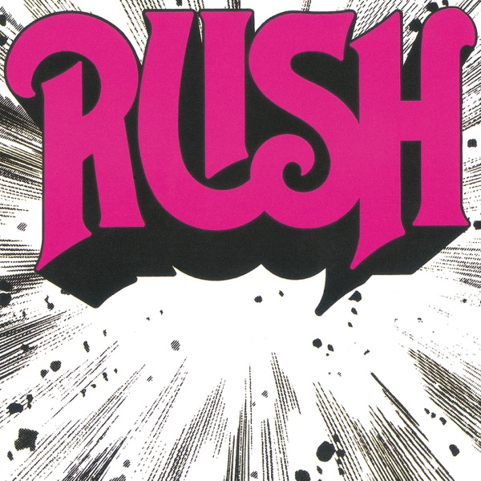

### 📻 Audioshow - EP_115

"As my memory rests
But never forgets what I lost
Wake me up when September ends"

Wake Me Up When September Ends
- Green Day
- American Idiot
- 2004
- Billie Joe Armstrong, Mike Dirnt & Tré Cool

### 📻 Audioshow - EP_116

"It’s been a hard day’s night
And I’ve been working like a dog
It’s been a hard day’s night
I should be sleeping like a log"

A Hard Day’s Night
- The Beatles
- A Hard Day’s Night
- 1964
- John Lennon, Paul McCartney

### 📻 Audioshow - EP_117

"It's hard enough losin'
The paper illusion
You've hidden inside
Without the confusion
Of findin' you're usin'
The crutch of the lie
To shelter your pride when you cry"

Round & Round (It Won't Be Long)
- Neil Young & Crazy Horse
- Everybody Knows This Is Nowhere
- 1969
- Neil Young

### 📻 Audioshow - EP_118

"We ride the waves
Distance is gone, will we find out
How life began, will we find out
Speeding through the universe
Thinking is the best way to travel"

The Best Way to Travel
- The Moody Blues
- In Search of the Lost Chord
- 1968
- Michael Pinder

### 📻 Audioshow - EP_119

"The flames are high
The piper's call contagious"

The Piper's Call
- David Gilmour
- Luck and Strange
- 2024
- David Gilmour

### 📻 Audioshow - EP_120

"Well I know what's right
I got just one life
In a world that keeps on pushing me around
But I'll stand my ground
And I won't back down"

I Won't Back Down
- Tom Petty
- Full Moon Fever
- 1989
- Tom Petty & Jeff Lynne

### 📻 Audioshow - EP_121

"One, two, three o'clock
Four o'clock rock
Five, six, seven o'clock
Eight o'clock rock
Nine, ten, eleven o'clock
Twelve o'clock rock
We're gonna rock around the clock tonight"

Rock Around the Clock
- Bill Haley and His Comets
- Biggest Hits
- 1955
- Jimmy De Knight & Max C. Freedman

### 📻 Audioshow - EP_122

"When the sunshine is not enough to make me feel bright
It's got me suffering in the darkness
That's so easy come by on the roadside
Of one long lifetime"

Deep Blue
- George Harrison
- Living in the Material World
- 1971
- George Harrison

### 📻 Audioshow - EP_123

"Wish you peace when times are hard
A light to guide you through the dark
And when storms are high and your dreams are low
I wish you the strength to let love grow"

I Wish You Peace
- Eagles
- One of These Nights
- 1975
- Bernie Leadon & Patti Davis

### 📻 Audioshow - EP_124

"California, rest in peace
Simultaneous release
California, show your teeth
She's my priestess, I'm your priest"

Dani California
- Red Hot Chili Peppers
- Stadium Arcadium
- 2006
- Anthony Kiedis, Chad Smith, Flea & John Frusciante

### 📻 Audioshow - EP_125

"Well the first days are the hardest days
Don't you worry anymore
'Cause when life looks like Easy Street
There is danger at your door"

Uncle John's Band
- Grateful Dead
- Workingman's Dead
- 1970
- Jerry Garcia & Robert Hunter

### 📻 Audioshow - EP_126

"It's my life, it's now or never
I ain't gonna live forever
I just want to live while I'm alive"

It's My Life
- Bon Jovi
- Crush
- 2000
- Jon Bon Jovi, Richie Sambora & Max Martin

### 📻 Audioshow - EP_127

"These are the days it never rains, but it pours"

Under Pressure (feat. David Bowie)
- Queen
- Hot Space
- 1981
- David Bowie, Brian May, Roger Taylor, John Deacon & Freddie Mercury

### 📻 Audioshow - EP_128

"And when it's time for leavin', I hope you'll understand
That I was born a ramblin' man"

Ramblin' Man
- The Allman Brothers Band
- Brothers and Sisters
- 1973
- Richard Betts

### 📻 Audioshow - EP_129

"Oh, you know, the railroad is a mighty good line
Come on and ride the railroad, one more time"

The Railroad
- Grand Funk Railroad
- We're An American Band
- 1973
- Mark Farner

### 📻 Audioshow - EP_130

"Mine's tale that can't be told
My freedom I hold dear
How years ago in days of old
When magic filled the air"

Ramble On
- Led Zeppelin
- Led Zeppelin II
- 1969
- Jimmy Page & Robert Plant

### 📻 Audioshow - EP_131

"All our times have come
Here but now they're gone
Seasons don't fear the reaper
Nor do the wind, the sun or the rain"

(Don't Fear) The Reaper
- Blue Öyster Cult
- Agents of Fortune
- 1976
- Buck Dharma

### 📻 Audioshow - EP_132

"Purple rain, purple rain
Purple rain, purple rain"

Purple Rain
- Prince & The Revolution
- Purple Rain
- 1984
- Prince

### 📻 Audioshow - EP_133

"He's a pinball wizard, there has to be a twist
A pinball wizard's got such a supple wrist"

Pinball Wizard
- The Who
- Tommy
- 1969
- Pete Townshend

### 📻 Audioshow - EP_134

"He deals the cards to find the answer
The sacred geometry of chance
The hidden law of a probable outcome
The numbers lead a dance"

Shape of My Heart
- Sting
- Ten Summoner's Tales
- 1993
- Sting & Dominic Miller

### 📻 Audioshow - EP_135

"Ground Control to Major Tom
Your circuit's dead, there's something wrong
Can you hear me, Major Tom?
Can you hear me, Major Tom?
Can you hear me, Major Tom?
Can you hear..."

Space Oddity
- David Bowie
- David Bowie (aka Space Oddity)
- 1969
- David Bowie

.jpg>)

### 📻 Audioshow - EP_136

"No more speed, I'm almost there
Gotta keep cool now, gotta take care
Last car to pass, here I go
And the line of cars drove down real slow"

Radar Love
- Golden Earring
- Radar Love - Single
- 1973
- Barry Hay & George Kooymans

### 📻 Audioshow - EP_137

"But you know he'll always keep moving
You know he's never gonna stop moving
'Cause he's rolling, he's the rolling stone
When you wake up, it's a new morning
The sun is shining, it's a new morning
And you're going, you're going home"

Baker Street
- Gerry Rafferty
- City to City
- 1978
- Gerry Rafferty

### 📻 Audioshow - EP_138

"Some friends of mine, just the other night
Went to hear this cool cat blow
The say he sang so good that the roof fell in
And he didn't even stop the show
They don't remember the place
But they remember the face"

Top Jimmy
- Van Halen
- 1984
- 1984
- Alex Van Halen, David Lee Roth, Eddie Van Halen & Michael Anthony

### 📻 Audioshow - EP_139

"See the pages as they turn
In their wisdom we will learn
Free from the prison, a Curtain of Iron"

Curtain of Iron
- Kansas
- Audio-Visions
- 1980
- Kerry Livgren

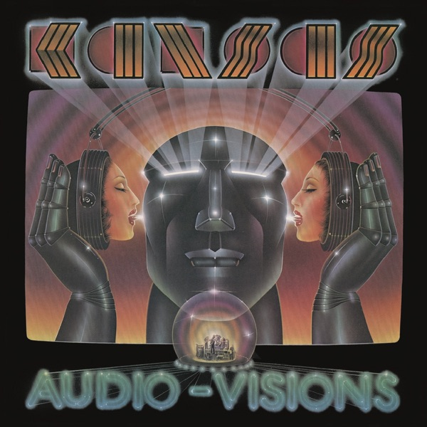

### 📻 Audioshow - EP_140

"Some'll win, some will lose
Some are born to sing the blues
Oh, the movie never ends
It goes on and on and on and on"

Don't Stop Believin'
- Journey
- Escape
- 1981
- Steve Perry, Neal Schon & Jonathan Cain

### 📻 Audioshow - EP_141

"Tender is the ghost
The ghost I love the most
Hiding from the sun
Waiting for the night to come"

Tender
- Blur
- 13
- 1998
- Alex James, Damon Albarn, Dave Rowntree & Graham Coxon

### 📻 Audioshow - EP_142

"And where do we go from here
Which is the way that's clear"

Rock On
- David Essex
- Rock On
- 1973
- David Essex

### 📻 Audioshow - EP_143

"I close my eyes
Only for a moment
And the moment's gone
All my dreams
Pass before my eyes
A curiosity"

Dust In the Wind
- Kansas
- Point of Know Return
- 1977
- Kerry Livgren

### 📻 Audioshow - EP_144

"Moon river, wider than a mile
I'm crossing you in style someday
Oh, dream maker, you heart breaker
Wherever you're goin', I'm goin' your way verse"

Moon River
- Eric Clapton & Jeff Beck
- Meanwhile
- 2024
- Johnny Mercer & Henry Mancini

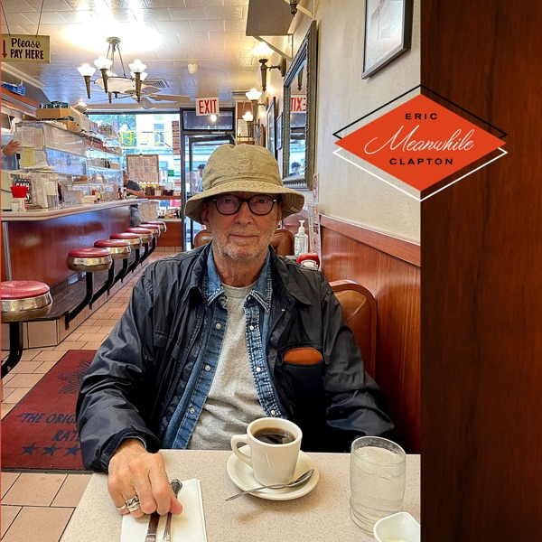

### 📻 Audioshow - EP_145

"仍然自由自我
永遠高唱我歌
走遍千里"

海闊天空
- Beyond
- 樂與怒
- 1993
- 黃家駒

### 📻 Audioshow - EP_146

"(Here I am) Here I am
Will you send me an angel?
(Here I am) Here I am
In the land of the morning star"

Send Me an Angel (Unplugged Live)
- Scorpions
- MTV Unplugged: Scorpions In Athens (Live)
- 2013
- Rudolf Schenker

.jpg>)

### 📻 Audioshow - EP_147

"History shows again and again
How nature points out the folly of man
Godzilla"

Godzilla
- Blue Öyster Cult
- Spectres
- 1977
- Buck Dharma

### 📻 Audioshow - EP_148

"Some dance to remember
Some dance to forget"

Hotel California (Live On MTV, 1994)
- Eagles
- Hell Freezes Over
- 1994
- Don Felder & Don Henley

### 📻 Audioshow - EP_149

[Instrumental]

The Lighting of the Beacons
- Howard Shore
- The Lord of the Rings: The Return of the King - The Complete Recordings
- 2007
- Howard Shore

### 📻 Audioshow - EP_150

"'Cause I'm T.N.T.
I'm dynamite
T.N.T.
And I'll win the fight
T.N.T.
I'm a power load
T.N.T.
Watch me explode"

Lose Yourself
- Eminem
- 8 Mile (Music From And Inspired By The Motion Picture)
- 2002
- Jeff Bass, Luis Resto & Marshall Mathers

.jpg>)

### 📻 Audioshow - EP_151

"We ain't no legends, ain't no cause"

For Those About to Rock (We Salute You)
- AC/DC
- For Those About to Rock (We Salute You)
- 1981
- Angus Young, Malcolm Young & Brian Johnson

.jpg>)

### 📻 Audioshow - EP_152

"Hello, I've waited here for you
Everlong"

Everlong
- Foo Fighters
- The Colour And The Shape
- 1997
- Dave Grohl

### 📻 Audioshow - EP_153

"Black hole sun, won't you come
And wash away the rain?"

Black Hole Sun
- Soundgarden
- Superunknown
- 1994
- Chris Cornell

### 📻 Audioshow - EP_154

"Four, five, six
Seven, eight, nine, ten
Eleven, twelve"

A Day In the Life
- The Beatles
- Sgt. Pepper's Lonely Hearts Club Band
- 1967
- John Lennon & Paul McCartney

### 📻 Audioshow - EP_155

"Believe the word
I will unlock my door
And pass the cemetery gates"

Cemetery Gates
- Pantera
- Cowboys from Hell
- 1990
- Dimebag Darrell, Philip H. Anselmo, Rex Brown & Vinnie Paul

### 📻 Audioshow - EP_156

"And so I wake in the morning and I step outside
And I take a deep breath and I get real high
And I scream from the top of my lungs
'What's going on?'"

What's Up?
- 4 Non Blondes
- Bigger, Better, Faster, More!
- 1992
- Linda Perry

### 📻 Audioshow - EP_157

"I bless the rains down in Africa
Gonna take some time to do the things we never had"

Africa
- Toto
- Toto IV
- 1982
- David Paich & Jeffrey Porcaro

### 📻 Audioshow - EP_158

"Call me Desdenova
Eternal light
These gribbly digs of mine
Will show me proof of sight
And don't forget my dog
Fixed in consequence"

Astronomy
- Blue Öyster Cult
- Secret Treaties
- 1974
- J. Bouchard, A. Bouchard & S. Pearlman

### 📻 Audioshow - EP_159

"And somewhere in the darkness, the gambler, he broke even
But in his final words, I found an ace that I could keep"

The Gambler
- Kenny Rogers
- The Gambler
- 1978
- Don Alan Schlitz Jr.

### 📻 Audioshow - EP_160

"Wasting days and days
On this fight
Always down and up
Half the night"

Smile
- David Gilmour
- On An Island
- 2006
- David Gilmour

### 📻 Audioshow - EP_161

"So many moons have flown
Now all your ghosts dance the long shadows
War cries that died on your lips
Echo above the plains"

Echoes
- Camel
- Breathless
- 1978
- Andrew Latimer, Andy Ward & Peter Bardens

### 📻 Audioshow - EP_162

"But I still haven't found what I'm looking for
But I still haven't found what I'm looking for"

I Still Haven't Found What I'm Looking For
- U2
- The Joshua Tree
- 1987
- The Edge, Bono, Adam Clayton & Larry Mullen Jr.

### 📻 Audioshow - EP_163

"Sometimes I hate the road
But it's the only life I know
But I'm livin' the life that I chose
So I'll life out my life on the road"

Life on the Road
- The Kinks
- Sleepwalker
- 1977
- Raymond Douglas Davies

### 📻 Audioshow - EP_164

"When the winter rains come pouring down
On that new home of mine
Will you think of me, and wonder if I'm fine?"

Journey Through the Past
- Neil Young
- Time Fades Away
- 1973
- Neil Young

### 📻 Audioshow - EP_165

"You see it's all clear
You were meant to be here
From the beginning"

From the Beginning
- Emerson, Lake & Palmer
- Trilogy
- 1970
- Greg Lake

### 📻 Audioshow - EP_166

"Pleased to meet you
Hope you guess my name
But what's puzzlin' you
Is the nature of my game"

Sympathy For The Devil
- The Rolling Stones
- Beggars Banquet
- 1968
- Mick Jagger & Keith Richards

### 📻 Audioshow - EP_167

"You need to clear away
All the jetsam in your brain
And face the truth"

Drive Home
- Steven Wilson
- The Raven That Refused to Sing
- 2013
- Steven Wilson

### 📻 Audioshow - EP_168

"Sometimes everything is wrong
Now it's time to sing along"

Everybody Hurts
- R.E.M.
- Automatic For The People
- 1992
- William Berry, Peter Buck, Michael Mills & Michael Stipe

### 📻 Audioshow - EP_169

"Don't let the days go by
Glycerine
Glycerine"

Glycerine
- Bush
- Sixteen Stone
- 1994
- Gavin Rossdale

### 📻 Audioshow - EP_170

"Have you seen her, have you heard?
The way she plays, there are no words
To describe the way I feel"

She Bangs the Drums
- The Stone Roses
- Stone Roses
- 1989
- John Squire & Ian Brown

### 📻 Audioshow - EP_171

[Instrumental]

Day One (Interstellar Theme)
- Hans Zimmer
- Interstellar (Original Motion Picture Soundtrack) [Expanded Edition]
- 2014
- Hans Zimmer

.jpg>)

### 📻 Audioshow - EP_172

"Sometimes the lights all shining on me
Other times I can barely see
Lately it occurs to me
What a long strange trip it's been"

Truckin'
- Grateful Dead
- American Beauty
- 1970
- Bob Weir, Jerry Garcia, Phil Lesh & Robert Hunter

### 📻 Audioshow - EP_173

"I'm starting with the man in the mirror
I'm asking him to change his ways
And no message could've been any clearer
If you wanna make the world a better place
Take a look at yourself and then make a change"

Man In the Mirror
- Michael Jackson
- Bad
- 1987
- Siedah Garrett & Glen Ballard

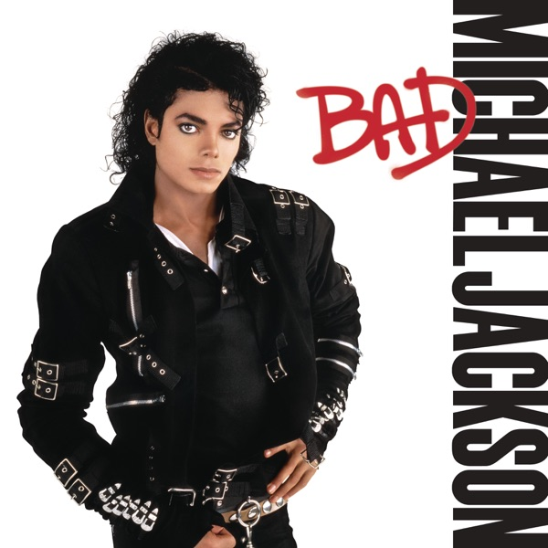

### 📻 Audioshow - EP_174

"Intense silence
As she walked in the room
Her black robes trailing
Sister of the moon"

Sisters of the Moon
- Fleetwood Mac
- Tusk
- 1979
- Stevie Nicks

### 📻 Audioshow - EP_175

"I know it's hard to keep an open heart
When even friends seem out to harm you
But if you could heal a broken heart
Wouldn't time be out to charm you?"

November Rain
- Guns N' Roses
- Use Your Illusion I
- 1991
- Axl Rose, Jeffrey Isbell, Saul Hudson & Duff McKagan

### 📻 Audioshow - EP_176

"Highway to the danger zone
Ride into the danger zone"

Danger Zone
- Kenny Loggins
- Top Gun (Original Motion Picture Soundtrack)
- 1986
- Giorgio Moroder & Thomas Whitlock

.jpg>)

### 📻 Audioshow - EP_177

"Don't know why I'm hoping for what I won't receive
Falling for the promise of the emptiness machine
The emptiness machine"

The Emptiness Machine
- LINKIN PARK
- From Zero
- 2024
- LINKIN PARK

### 📻 Audioshow - EP_178

"Beneath the wind turned wave
Infinite peace
Islands join hands
'Neath heaven's sea"

Islands
- King Crimson
- Islands
- 1971
- Peter Sinfield, Robert Fripp

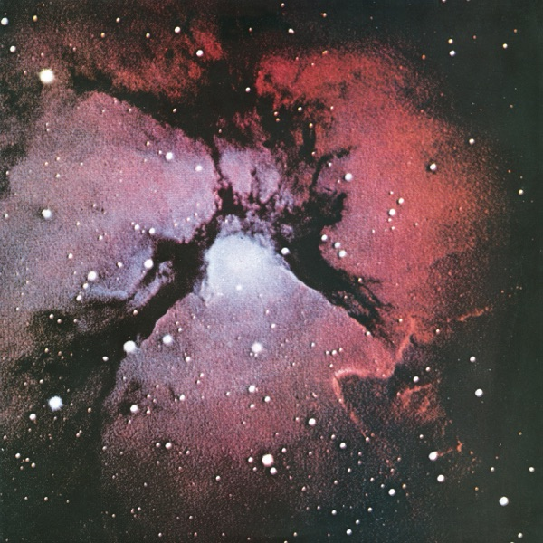

### 📻 Audioshow - EP_179

"Why don't you all fade away?
And don't try to dig what we all s-s-say"

My Generation
- The Who
- My Generation
- 1965
- Pete Townshend

.jpg>)

### 📻 Audioshow - EP_180

"Every dog has his day
Rock and roll's here to stay"

R.I.P. (Rock In Peace)
- AC/DC
- Backtracks
- 2009
- Angus Young, Bon Scott & Malcolm Young

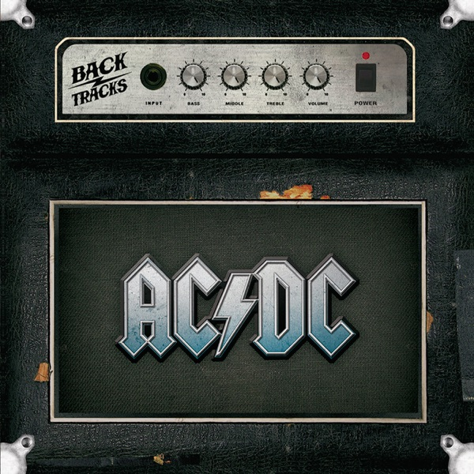

### 📻 Audioshow - EP_181

[Instrumental]

Indiscipline
- King Crimson
- Discipline
- 1981
- Robert Fripp, Adrian Belew, Bill Bruford & Tony Levin

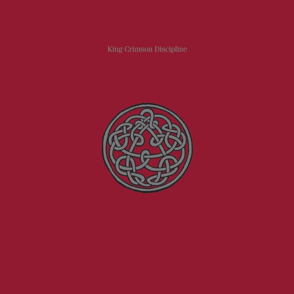

### 📻 Audioshow - EP_182

"Spread my arms and soak up congratulations"

Congratulations
- MGMT
- Congratulations
- 2010
- Andrew VanWyngarden & Ben Goldwasser

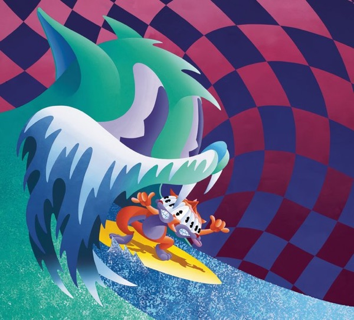

### 📻 Audioshow - EP_183

"People talking without speaking
People hearing without listening
People writing songs that voices never share
And no one dared
Disturb the sound of silence"

The Sound of Silence
- Simon & Garfunkel
- Sounds of Silence
- 1965
- Paul Simon

### 📻 Audioshow - EP_184

[Instrumental]

Ladyfingers
- Herb Alpert & The Tijuana Brass
- Whipped Cream & Other Delights
- 1965
- Toots Thielemans

### 📻 Audioshow - EP_185

[Instrumental]

Soothsayer (dedicated to Aunt Suzie)
- Buckethead
- Crime Slunk Scene
- 2006
- Buckethead

### 📻 Audioshow - EP_186

[Instrumental]

A Song of Ice and Fire
- Ramin Djawadi
- Game of Thrones: Season 8 (Music from the HBO Series)
- 2019
- Ramin Djawadi

.jpg>)

### 📻 Audioshow - EP_187

"The building's not going as he planned
The foreman has injured his hand
The dozer will not clear a path
The driver swears he learned his math"

My Name Is Jonas
- Weezer
- Weezer
- 1994
- Rivers Cuomo, Patrick Wilson & Jason Cropper

### 📻 Audioshow - EP_188

"Cool the engines
Slow this rocket down
Cool the engines
Why don't you take a look around"

Cool the Engines
- Boston
- Third Stage
- 1986
- Tom Scholz, Brad Delp & Fran Sheehan

### 📻 Audioshow - EP_189

"I'd love to change the world
But I don't know what to do
So I'll leave it up to you"

I'd Love to Change the World
- Ten Years After
- A Space in Time
- 1971

### 📻 Audioshow - EP_190

"Mister Saturday Night Special
Got a barrel that's blue and cold"

Saturday Night Special
- Lynyrd Skynyrd
- Nuthin' Fancy
- 1975
- Ronnie Van Zant & Edward King

### 📻 Audioshow - EP_191

"This is my December
This is my time of the year
This is my December
This is all so clear"

My<Dsmbr
- LINKIN PARK
- Reanimation
- 2000
- Brad Delson, Chester Charles Bennington, David Michael Farrell, Joseph Hahn, Michael Kenji Shinoda & Robert Gregory Bourdon

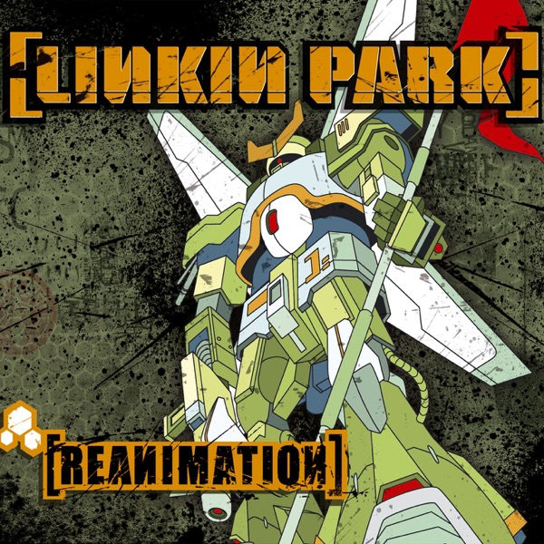

### 📻 Audioshow - EP_192

"When you hear my song now
You only get five percent
You used to get it all
You used to get it all"

Driftin' Back
- Neil Young & Crazy Horse
- Psychedelic Pill
- 2012
- Neil Young

### 📻 Audioshow - EP_193

"And your wise man don't know how it feels
To be thick as a brick"

Thick As A Brick, Pt. 1
- Jethro Tull
- Thick As A Brick
- 1972
- Ian Anderson

### 📻 Audioshow - EP_194

[Instrumental]

Slabo Day
- Peter Green
- In the Skies
- 1979
- Peter Green

### 📻 Audioshow - EP_195

"I've taken my bows and my curtain calls
You brought me fame and fortune and everything that goes with it
I thank you all"

We Are the Champions (Live at the Montreal Forum / November 1981)
- Queen
- Queen Rock Montreal (Live)
- 2007
- Freddie Mercury

.jpg>)

### 📻 Audioshow - EP_196

"Time may change me
But I can't trace time"

Changes
- David Bowie
- Hunky Dory
- 1971
- David Bowie

### 📻 Audioshow - EP_197

"It never rains in California
But girl, don't they warn ya
It pours, man, it pours"

It Never Rains In Southern California
- Albert Hammond
- It Never Rains In Southern California
- 1972
- Albert Hammond & Michael Hazelwood

### 📻 Audioshow - EP_198

"It never rains in California
But girl, don't they warn ya
It pours, man, it pours"

- Albert Hammond
- It Never Rains In Southern California
- 1972
- Albert Hammond & Michael Hazelwood

### 📻 Audioshow - EP_198

"Love lost, such a cost
Give me things that don't get lost
Like a coin that won't get tossed
Rolling home to you"

Old Man (Live)
- Neil Young
- Young Shakespeare (Live)
- 2021
- Neil Young

.jpg>)

### 📻 Audioshow - EP_199

[Instrumental]

Blue Train
- John Coltrane
- Blue Train
- 1958
- John Coltrane

### 📻 Audioshow - EP_200

[Instrumental]

Also Sprach Zarathustra, Op. 30: Prelude (Sonnenaufgang)
- Berlin Philharmonic & Herbert von Karajan
- Also Sprach Zarathustra
- 1993
- Richard Strauss

### 📻 Audioshow - EP_201

"If looks could kill they probably will
In games without frontiers, war without tears
Games without frontiers, war without tears"

Games Without Frontiers
- Peter Gabriel
- Peter Gabriel 3: Melt
- 1980
- Peter Gabriel

### 📻 Audioshow - EP_202

"'Cause under her mantle you feel safe from the cold
And you're safe from the danger of ever growing old"

Blue Light
- David Gilmour
- About Face
- 1984
- David Gilmour

### 📻 Audioshow - EP_203

"Easy to make
Easy to break
Something's here we don't understand"

Against The Odds (2023 Remix)
- Richard Wright
- Wet Dream (2023 Remix)
- 2023
- Richard Wright

.jpg>)

### 📻 Audioshow - EP_204

"Good on you son, good on you
The Camden shuffle and the old one-two"

Good On You Son
- Mark Knopfler
- Down the Road Wherever
- 2018
- Mark Knopfler

### 📻 Audioshow - EP_205

"An old cowboy went ridin' out one dark and windy day
Upon a ridge he rested as he went along his way
When all at once a mighty herd of red eyed steers he saw
A plonghin' through the ragged skies and up a cloudy draw"

(Ghost) Riders In the Sky
- The Outlaws
- Ghost Riders
- 1980
- S. Jones

### 📻 Audioshow - EP_206

"Somewhere in my memory
Christmas joys all around me
Living in my memory
All of the music
All of the magic
All of the family
Home here with me"

Main Title "Somewhere in My Memory" (From "Home Alone") [Voice]
- John Williams, The American Boychoir & Boston Pops Orchestra
- Home Alone (Original Motion Picture Soundtrack)
- 1990
- John Williams

.jpg>)

### 📻 Audioshow - EP_207

"Should old acquaintance be forgot,
and never brought to mind?
Should old acquaintance be forgot,
and auld lang syne?"

Auld Lang Syne
- Guy Lombardo
- Enjoy Yourself: The Hits of Guy Lombardo
- 1953
- Robert Burns

### 📻 Audioshow - EP_208

"It's a long way
Such a long way"

It's a Long Way to the Top (If You Wanna Rock 'N' Roll)
- AC/DC
- High Voltage
- 1975
- Angus Young, Bon Scott & Malcolm Young

<!-- 需要列出所有的喜欢/待喜欢的艺人，以及录音室专辑，甚至可以做一个系统->audiolib，然后从里面来抽audioshow -->

<!-- a.e. --- almost everyday --- bad things 是零测集 -->

